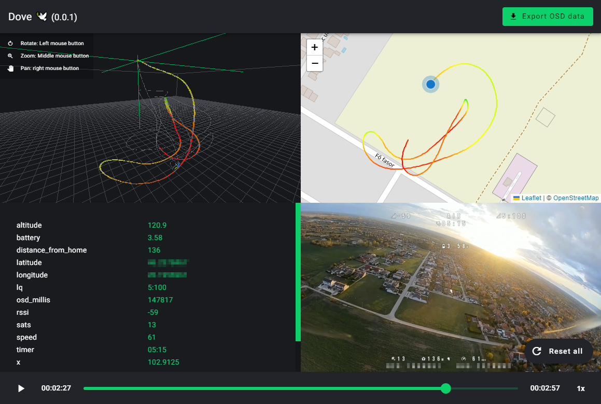

# Dove 🕊️ a flight review application

Dove is an open-source application based on [wtfOS](https://github.com/fpv-wtf/wtfos) OSD data, that lets review your drone flight on a map, even in a 3D space along with your OSD video.




## Setup and usage

##### User interface (Angular)
```
cd dove-ui
npm i
ng serve
```

##### Backend (Node.js)
```
cd dove-api
npm i
npm run start:dev
```
Finally open http://localhost:4200 in your browser.

Currently Dove supports the following data types:
- Latitude, Longitude, Altitude **(These three are required in order to work with Dove)!**
- Battery
- Distance from home
- LQ
- RSSI
- Satelites
- Speed
- Timer
